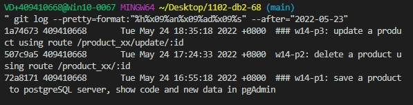

### w14-p1: save a product to postgreSQL server, show code and new data in pgAdmin

### w14-p2: delete a product using route /product_xx/:id

### w14-p3: update a product using route /product_xx/update/:id

