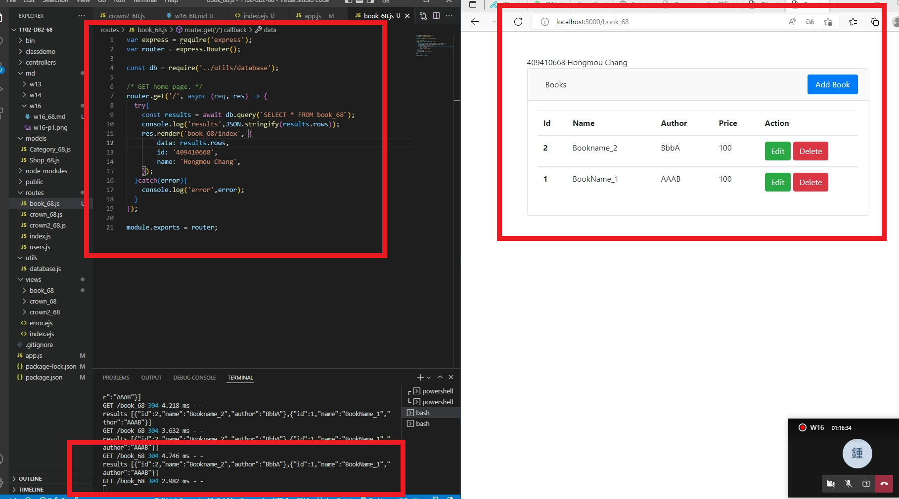
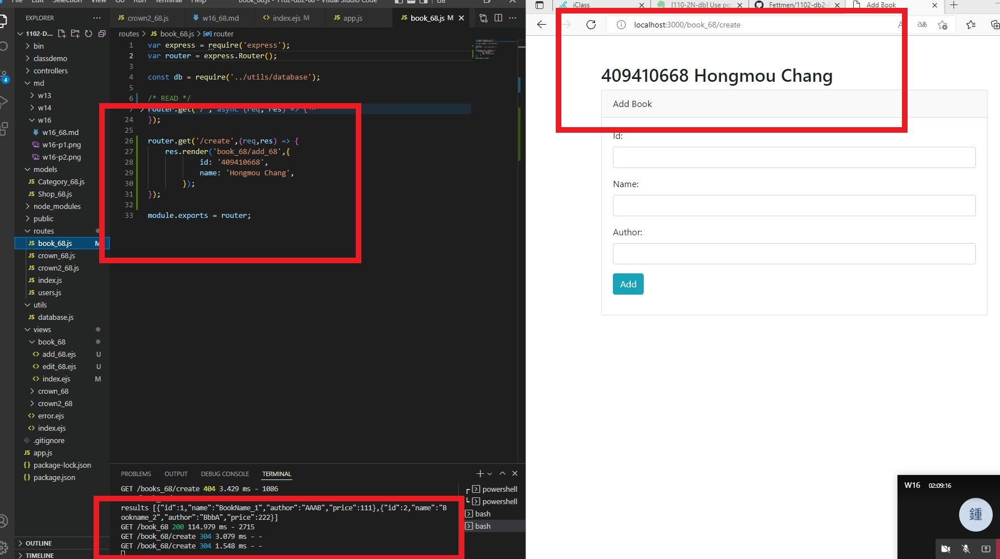
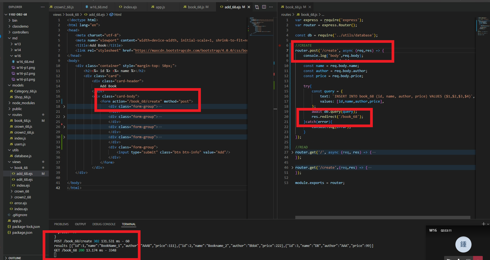
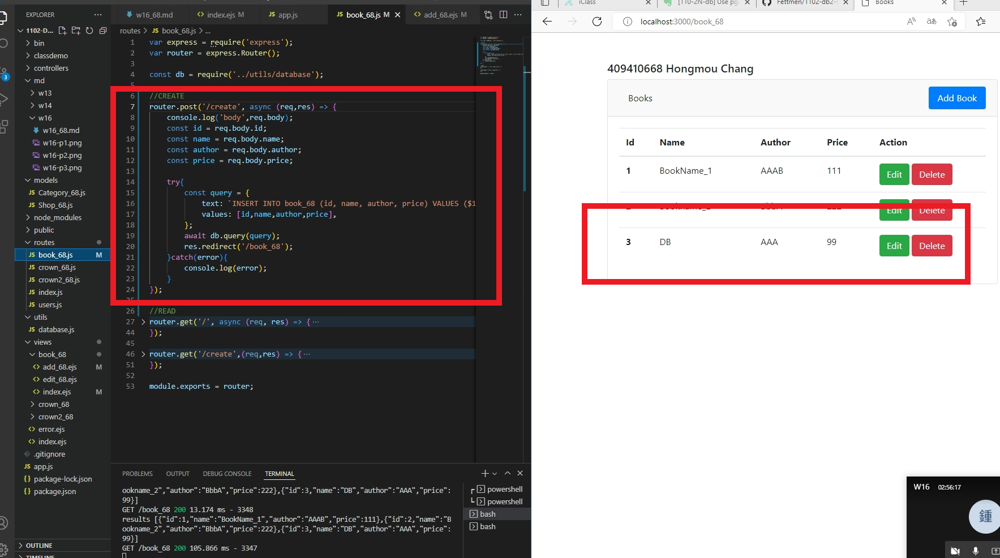

### w16-p1: create book_xx in postgreSQL server, enter two data


### w16-p2: get all data from table book_xx




### w16-p3: /book_xx/create to book_xx/add_xx.ejs




### w16-p4: POST /book_xx/create to create a book data







### w16-LAST-log

```
a2fa5ff 409410668       Tue Jun 7 18:05:16 2022 +0800   ### w16-p4: POST /book_xx/create to create a book data
3934b53 409410668       Tue Jun 7 17:16:19 2022 +0800   ### w16-p2: get all data from table book_xx
e29d48a 409410668       Tue Jun 7 16:24:44 2022 +0800   ### w16-p2: get all data from table book_xx
e11db61 409410668       Tue Jun 7 15:50:22 2022 +0800   ### w16-p1: create book_xx in postgreSQL server, enter two data
```


--------------------

git log --pretty=format:"%h%x09%an%x09%ad%x09%s" --after="2022-06-06"

--------------------