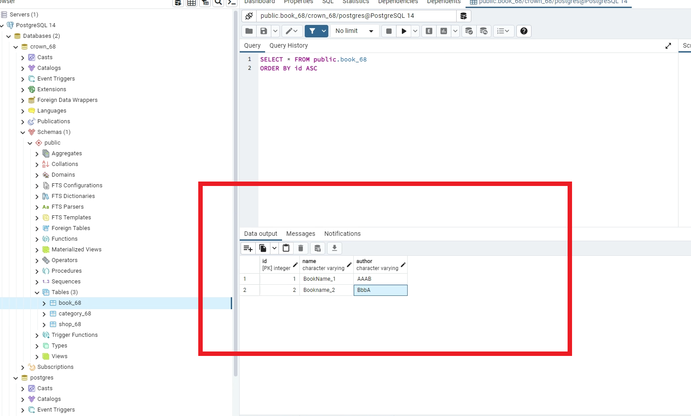

### w16-p1: create book_xx in postgreSQL server, enter two data

--------------------

git log --pretty=format:"%h%x09%an%x09%ad%x09%s" --after="2022-06-06"

--------------------

### w16-p2: get all data from table book_xx

### w16-p3: /book_xx/create to book_xx/add_xx.ejs

